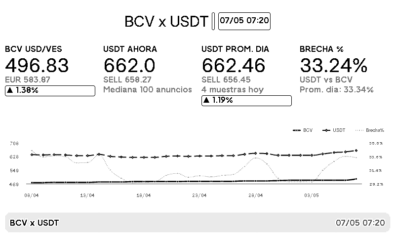

# 📟 TRMNL BCV x USDT

> Plugin para dispositivos [TRMNL](https://usetrmnl.com) que muestra en tiempo real las tasas de cambio del **Banco Central de Venezuela (BCV)** y el mercado **P2P de Binance (USDT/VES)**, incluyendo la brecha cambiaria y tendencias históricas.

---

## 📸 Vista previa



---

## ✨ Funcionalidades

- **Tasa BCV oficial** — USD/VES y EUR/VES scrapeados directamente de [bcv.org.ve](https://www.bcv.org.ve)
- **Binance P2P** — Mediana y promedio de los **100 primeros anuncios** de compra y venta de USDT/VES
- **Brecha cambiaria %** — Diferencia entre el USDT P2P y la tasa BCV oficial
- **Promedio del día** — Acumula muestras de Binance a lo largo del día para un promedio más representativo
- **Historial y gráfica** — Tendencia de BCV, USDT y brecha % de los últimos 30 días
- **Cambio % vs última tasa diferente** — El BCV no cambia todos los días; el porcentaje se calcula contra la última tasa realmente distinta
- **Actualización automática** — GitHub Actions corre cada ~5 minutos sin necesidad de servidor propio

---

## 🏗️ Arquitectura

```
GitHub Actions (cada ~5 min)
    └── fetch_rates.py
            ├── Consulta BCV (solo entre 3AM–8AM VET)
            ├── Consulta Binance P2P (100 anuncios BUY + SELL)
            ├── Actualiza data/rates_history.csv
            ├── Actualiza data/binance_samples.csv
            └── Genera data/output.json
                    └── TRMNL lee el JSON via Polling URL
```

### Archivos principales

| Archivo | Descripción |
|---|---|
| `rates_server.py` | Lógica central: scraping, cálculos, historial |
| `fetch_rates.py` | Script de una sola ejecución para GitHub Actions |
| `src/full.liquid` | Markup vista completa con gráfica Highcharts |
| `src/quadrant.liquid` | Markup vista cuadrante (datos clave sin gráfica) |
| `data/output.json` | JSON generado automáticamente, consumido por TRMNL |
| `data/rates_history.csv` | Historial diario de tasas BCV y promedios Binance |
| `data/binance_samples.csv` | Muestras intradía de Binance (cada ~5 min) |

---

## 📊 Datos que muestra

### Vista completa (`full`)
- **BCV USD/VES** — Tasa oficial + EUR + variación % vs última tasa diferente
- **USDT Ahora** — Mediana de 100 anuncios P2P en tiempo real (BUY y SELL)
- **USDT Prom. Día** — Promedio acumulado del día + contador de muestras
- **Brecha %** — `(USDT - BCV) / BCV × 100`
- **Gráfica de tendencia** — BCV, USDT promedio y brecha % en los últimos 30 días con ejes calibrados

### Vista cuadrante (`quadrant`)
- BCV USD/VES
- USDT P2P (mediana)
- Brecha %
- Variación BCV

---

## ⚙️ Lógica del BCV

El BCV venezolano tiene un comportamiento particular:

- Publica la tasa del **día hábil siguiente** alrededor de las **5–6 PM** del día anterior
- Para evitar que la tasa "de mañana" contamine el registro de hoy, **el script solo consulta el BCV entre las 3AM y 8AM VET**
- Fuera de esa ventana horaria, usa la última tasa conocida del CSV
- El cambio % se calcula contra la **última tasa diferente**, no simplemente contra ayer — esto maneja correctamente fines de semana y feriados donde la tasa no cambia

---

## 🚀 Instalación y configuración

### Requisitos
- Cuenta en [TRMNL](https://usetrmnl.com)
- Cuenta en [GitHub](https://github.com)

### Pasos

**1. Fork o clona este repositorio**
```bash
git clone https://github.com/vhurdaneta/trmnl-bcv-usdt.git
```

**2. Activa GitHub Actions**

El workflow `.github/workflows/update_rates.yml` corre automáticamente cada ~5 minutos y actualiza `data/output.json`.

**3. Copia el Polling URL**

```
https://raw.githubusercontent.com/vhurdaneta/trmnl-bcv-usdt/master/data/output.json
```

**4. Configura el plugin en TRMNL**

- Strategy: `Polling`
- Polling URL: la URL del paso anterior
- Polling Verb: `GET`
- Refresh interval: `Every 15 mins`

**5. Pega el markup**

Copia el contenido de `src/full.liquid` en el editor de markup de TRMNL (vista Full). Opcionalmente `src/quadrant.liquid` para la vista cuadrante.

---

## 📁 Estructura del repositorio

```
trmnl-bcv-usdt/
├── .github/
│   └── workflows/
│       └── update_rates.yml      # GitHub Actions
├── assets/
│   └── preview.png               # Screenshot del plugin
├── data/
│   ├── output.json               # JSON generado automáticamente
│   ├── rates_history.csv         # Historial diario
│   └── binance_samples.csv       # Muestras intradía Binance
├── src/
│   ├── full.liquid               # Vista completa TRMNL
│   ├── quadrant.liquid           # Vista cuadrante TRMNL
│   ├── half_horizontal.liquid
│   ├── half_vertical.liquid
│   ├── settings.yml
│   └── shared.liquid
├── fetch_rates.py                # Entry point para GitHub Actions
├── rates_server.py               # Lógica principal
└── .gitignore
```

---

## 🛠️ Desarrollo local

```bash
# Instalar dependencias
pip install requests beautifulsoup4 urllib3

# Correr una vez (genera data/output.json)
python fetch_rates.py

# Correr como servidor HTTP local
python rates_server.py
# → http://localhost:8000/summary.json
```

Para probar con Docker:
```bash
docker run --rm -p 4567:4567 -v ${PWD}:/plugin trmnl/trmnlp serve
```

---

## 📝 Notas sobre Venezuela

- El **BCV** es el tipo de cambio oficial, publicado cada día hábil
- El **mercado P2P de Binance** refleja el precio real al que la gente compra y vende dólares
- La **brecha cambiaria** entre ambos es un indicador clave de la economía informal
- Los fines de semana y feriados bancarios la tasa BCV no cambia — el plugin lo maneja correctamente

---

## 📄 Licencia

MIT — libre de usar, modificar y distribuir.

---

*Hecho con ❤️ para la comunidad venezolana.*
